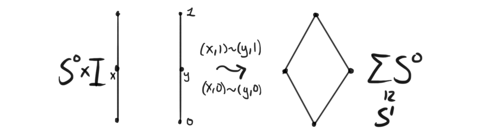

Este es un ejemplo de cita [CITA]().
\[
    f(x)=3
\]

Una definicion

**Definition (l.e.s):** A long sequence of objects (in our case usually groups or pointed spaces) 

$$
\cdots \longrightarrow A_{n+1} \overset{d_{n+1}} \longrightarrow A_n \overset{d_n} \longrightarrow A_{n-1} \longrightarrow \cdots 
$$
is called exact at $A_n$ if $\text{Ker}(d_n)=\text{Im}(d_{n+1})$ . The sequence is called exact if it is exact for every $n.$

## Seccion 1

Algun texto

## Seccion 2

mas texto

$$\cdots \rightarrow [\Sigma^n S^0, X] \rightarrow [\Sigma^n S^0, Y] \rightarrow [\Sigma^{n-1} S^0, hofib(p)] \rightarrow \cdots .$$

Ejemplo de Imagen

Since our map is a fibration, the homotopy fiber $hofib(p)$ has the same homotopy type as the usual fiber, and we can replace $[S^n, hofib(p)]$ by just $[S^n, F]$ . By this, we are done, since these spaces are the definitions of the higher homotopy groups, i.e. $\pi_n(X)\cong [S^n, X]$, thus we finally have our long exact sequence of homotopy groups

$$\cdots \rightarrow \pi_n(X) \rightarrow \pi_n(Y) \rightarrow \pi_{n-1}(F) \rightarrow \cdots .$$

## Seccion 3

Ejemplo de link [“Homotopy groups of spheres”](http://chronologia.org/en/math_impressions/poster034.html).